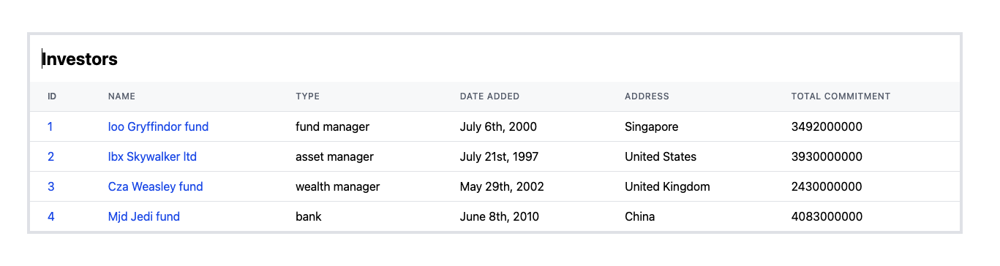
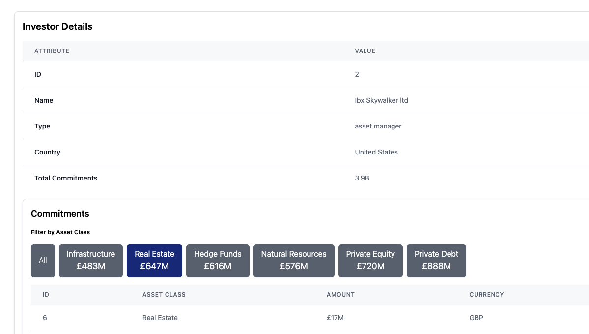

# Preqin Fullstack Interview Task

## Overview

This project is a solution for the Preqin Fullstack Technical Take-Home Task. It provides a web application that lists investors, their details, and the total of their commitments. Upon selecting an investor, users can view a breakdown of their commitments, with an option to filter by asset class.

## Preview

### Investor List



### Commitments



## Backend

### Tech Stack

- **Python** (FastAPI)
- **SQLite** (Database for demonstration purposes)
- **Uvicorn** (ASGI server)
- **SQLAlchemy** (ORM)
- **Pydantic** (Data validation)

### Features

- RESTful API to retrieve investors and their total commitments.
- Detailed API to view and filter investors' commitments by asset class.
- Ingestion of data from `data.csv` into an SQLite database.

### Running the Backend Locally

**Clone the repository:**

```bash
git clone https://github.com/your-repo/preqin-fullstack-interview-task.git
cd preqin-fullstack-interview-task/backend
```

### API Endpoints

- **GET /investors**: Retrieve a list of investors and their total commitments.
- **GET /investors/{investor_id}/commitments**: Retrieve a breakdown of the selected investor's commitments.
- **GET /commitments**: Optionally filter commitments by asset class.

The backend will be running at `http://127.0.0.1:8000`.

API documentation can be found at `http://127.0.0.1:8000/docs`.

## Frontend

### Tech Stack

- **React** (TypeScript)
- **Redux Toolkit** (State management)
- **React Router** (Routing)
- **Tailwind CSS** (Styling)
- **Axios** (API requests)

### Features

- Displays a list of investors with their details and total commitments.
- Ability to click on an investor to view detailed commitments.
- Filter commitments by asset class.
- Responsive design with Tailwind CSS.
- Centralized state management with Redux Toolkit for data handling and API calls.

### Running the Backend Locally

**Clone the repository:**

```bash
git clone https://github.com/your-repo/preqin-fullstack-interview-task.git
cd preqin-fullstack-interview-task/frontend
```

The frontend will be running at `http://192.168.1.26:3000`

---

### Improvement Plans

#### Backend

- Implement a better API with pagination.
- Utilize the asset class API to create dynamic filter buttons.
- Write additional unit and integration tests for API endpoints.
- Use a more scalable database for production, such as PostgreSQL.
- Implement centralized error handling across the application.
- Add proper error code handling for more meaningful responses.
- Containerize the backend using Docker for easier deployment.

#### Frontend

- Improve user error handling for better user experience.
- Add pagination to handle large datasets more effectively.
- Optimize API calls to reduce load times and improve performance.
- Write tests for components and API integration to ensure stability.
- Containerize the frontend using Docker for easier deployment.
